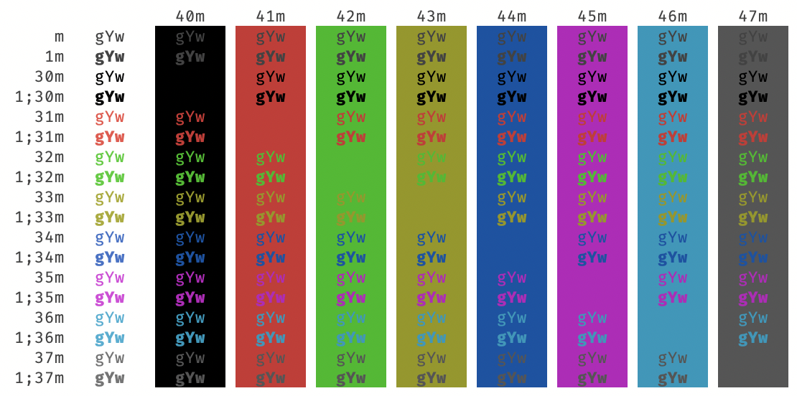
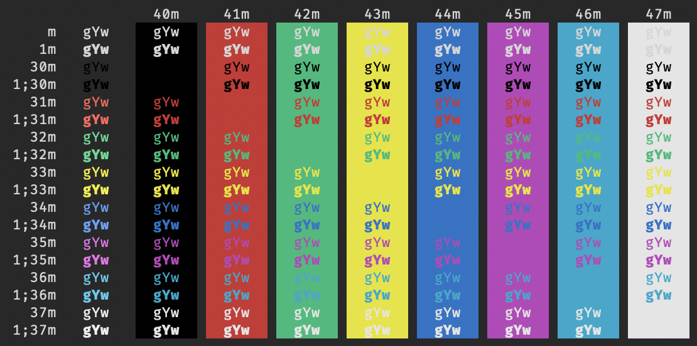

# VSCode Terminal Colors

This project contains terminal color scheme files to customize the macOS
Terminal to match the default Visual Studio Code color schemes. Included
are VSCode theme files and macOS Terminal profile files. The profile
fonts are set to FiraCode, but that can be changed to Menlo to match
the default VSCode font.

## Light+

## Dark+

## High Contrast

