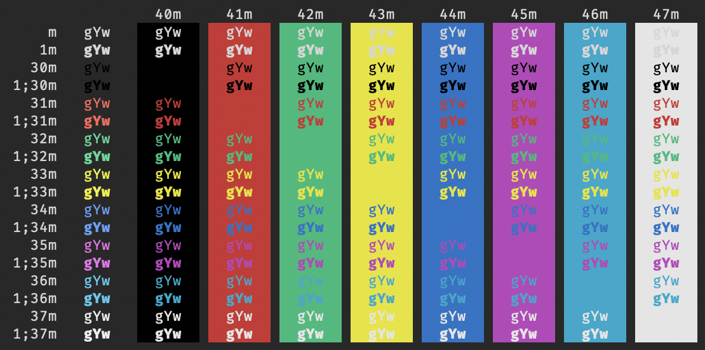
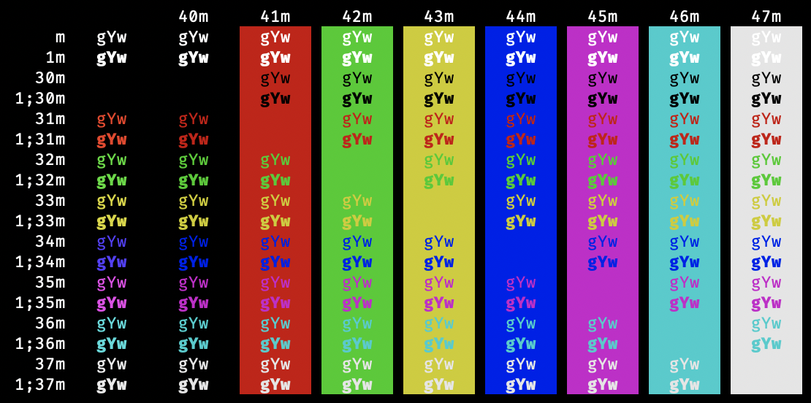

# VS Code Terminal Colors

This project contains color schemes to customize various terminals to
match the Visual Studio Code default color schemes.

Supported platforms:

- macOS Terminal
- mintty
- Windows Command Prompt
- Windows Terminal
- VS Code theme

Colors are sourced from `ansiColorMap` in
[`terminalColorRegistry.ts`](https://github.com/microsoft/vscode/blob/master/src/vs/workbench/contrib/terminal/common/terminalColorRegistry.ts).

## Previews

### Dark+ (default dark)

### Light+ (default light)

### High Contrast

