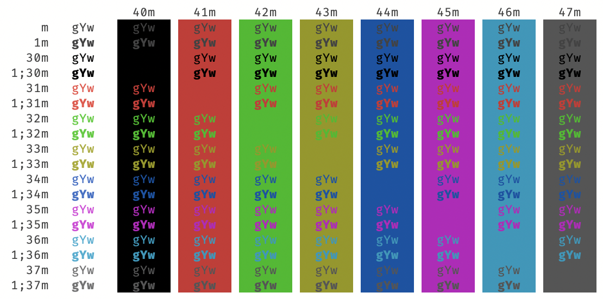
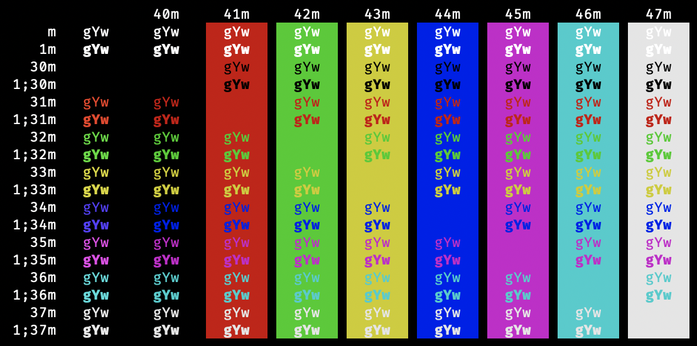

# VS Code Terminal Colors

This project contains terminal color scheme files to customize the macOS
Terminal and Windows Command Prompt to match the default Visual Studio
Code color schemes. Included are VS Code theme files, macOS Terminal
profile files, ini files for Color Tool on Windows, and Mintty settings.
The profile fonts are set to FiraCode, but that can be changed to Menlo
to match the default VS Code font.

Colors are sourced from `ansiColorMap` in
[`terminalColorRegistry.ts`](https://github.com/microsoft/vscode/blob/master/src/vs/workbench/contrib/terminal/common/terminalColorRegistry.ts).

## Light+ (default light)

## Dark+ (default dark)

## High Contrast

